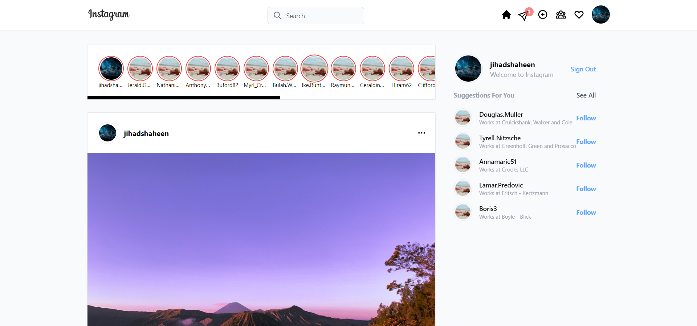
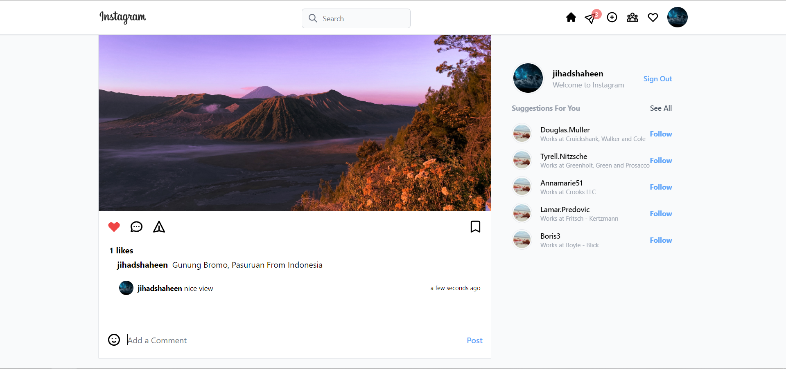
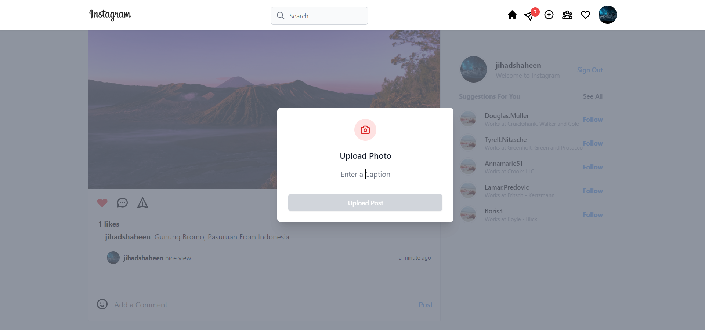
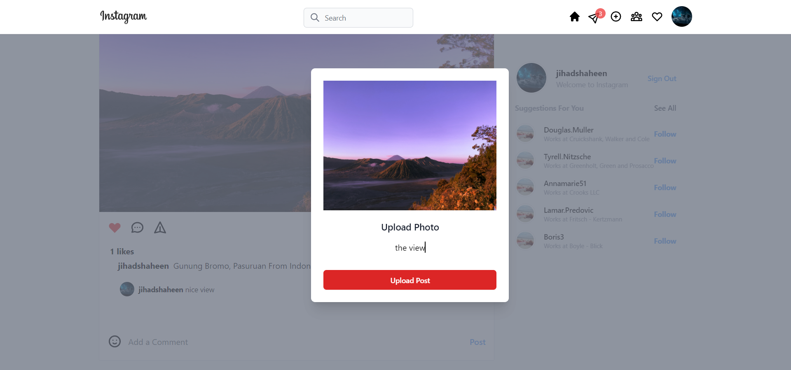
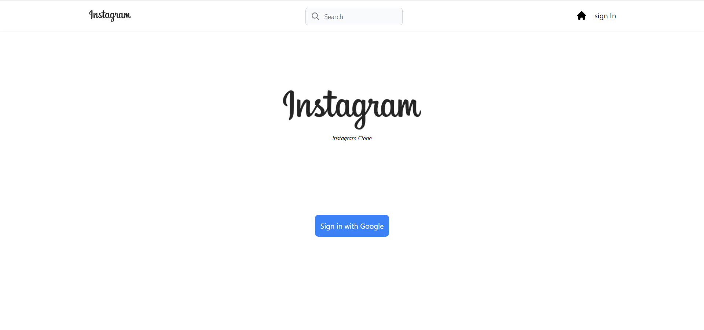

# Next.js - Instagaram Clone

You will need a google API_KEY and secret from google credentials for the auth and 
a firebase.js(in the root) file and the firebase config

## How to use

```bash
npm run dev
```

Based on Instagram, this project was designed in Next.js for the frontend and firebase for the backend (authentication and database management). The project has the add (post a caption and image), comment , like and number of likes functionality implemented.

 it has three main components :
•	Header - the Navbar 
•	Feed - the stories and the posts
•	Modal – the upload post


npm packages used:
1. Next.js
2. taliwind - a utility-first CSS framework 
3. @heroicons/react - tailwind icons
4. @tailwindcss/forms - A plugin that provides a basic reset for form styles
5. tailwind-scrollbar - for styling the scrollbars
6. faker@5.5.3 - to genrate fake data
7. next-auth - for authentication
8. firebase v9
9. recoil -  state management library
10. @headlessui/react - it is a set of completely unstyled, fully accessible UI components for React, designed to integrate with Tailwind CSS


Screenshots of the page















